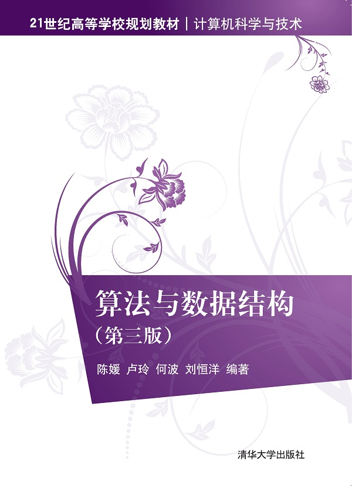

# Textbooks, 教材

## 课程教材

-   [陈媛,卢玲,何波,刘恒洋.算法与数据结构:第3版[M].北京:清华大学出版社,2020.](http://www.tup.tsinghua.edu.cn/booksCenter/book_07493701.html)

	

---

- [OI Wiki](https://oi-wiki.org/)
- [OpenDSA](https://opendsa-server.cs.vt.edu/)

---

Last Updated: Tue Oct  1 10:42:30 CST 2024