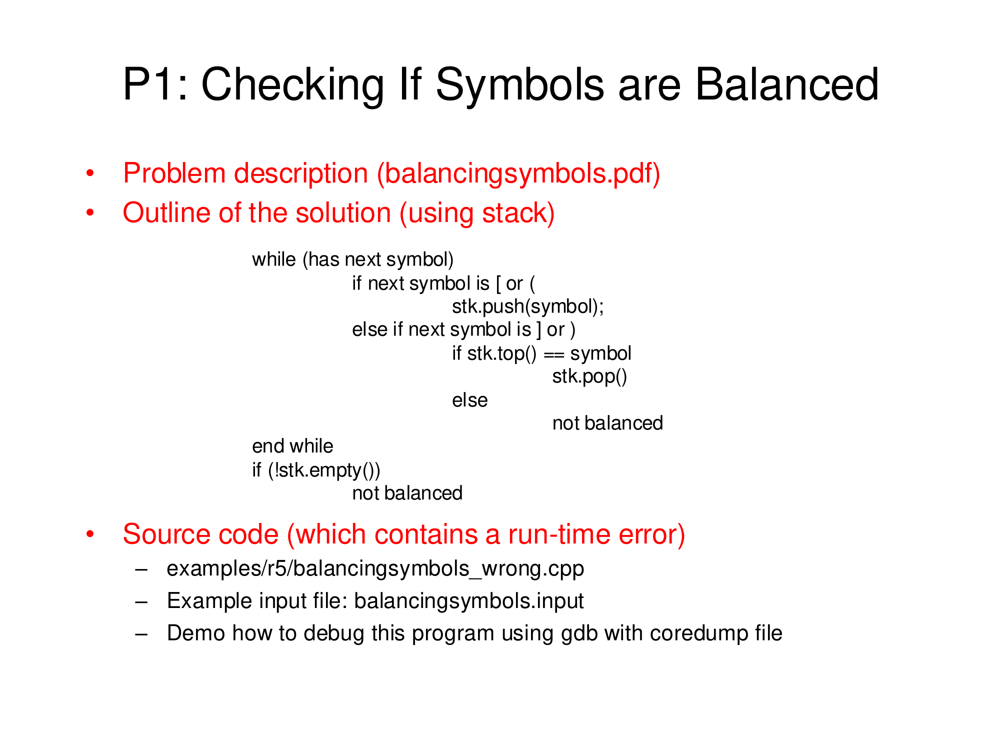
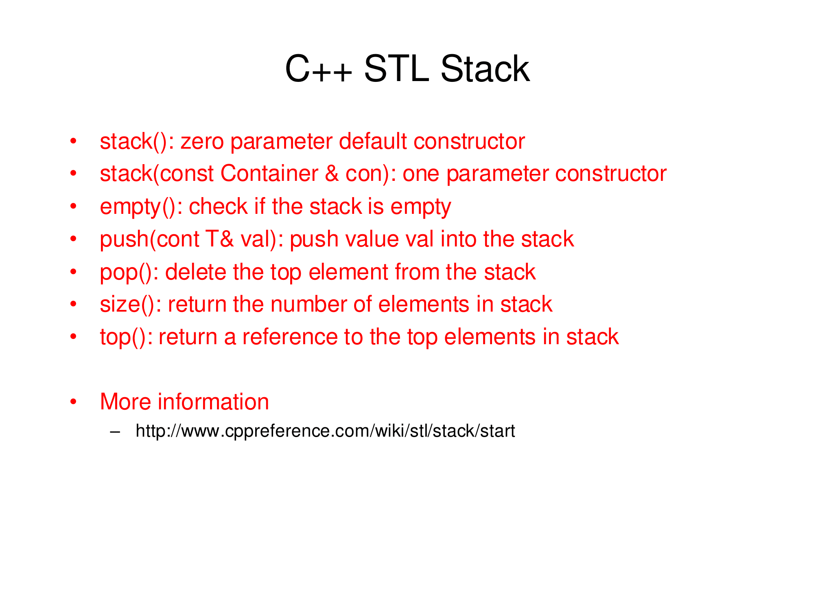

# Lab 04: Stack

- <https://www.cs.fsu.edu/~duan/classes/cop4530/examples/r5/r5.pdf>

## P1: Balancing Symbols

> 设计算法判断一个算术表达式的圆括号是否正确配对。 提示：对表达式进行扫描，凡遇 `(` 就入栈，遇 `)` 就将栈顶元素 `(` 出栈；表达式被扫描完毕，栈应为空。 



> [!question] Checking if Symbols are Balanced
> 
> We consider a limited version of the problem to check if symbols are balanced. We consider only two possible symbols: square brackets and parentheses. That is, `[`, `]`, `(`, and `)`. Symbols are balanced if the right bracket and parenthesis correspond to the left ones, respectively. For example, `()` is balanced, while `[])(` is not.
> 
> Write a program to check if symbols are balanced.
> 
> *from: https://www.cs.fsu.edu/~duan/classes/cop4530/examples/r5/balancingsymbols.pdf*

> [!quote] Balancing Symbols
> 
> Compilers check your programs for syntax errors, but frequently a lack of one symbol (such as a missing brace or comment starter) can cause the compiler to spill out a hundred lines of diagnostics without identifying the real error.
> 
> A useful tool in this situation is a program that checks whether everything is balanced. Thus, every right brace, bracket, and parenthesis must correspond to its left counterpart.
> 
> The sequence `()` is legal, but `(]` is wrong. Obviously, it is not worthwhile writing a huge program for this, but it turns out that it is easy to check these things. For simplicity, we will just check for balancing of parentheses, brackets, and braces and ignore any other character that appears.
> 
> **The simple algorithm uses a stack and is as follows:**
> 
> **Make an empty stack. Read characters until end of file. If the character is an opening symbol, push it onto the stack. If it is a closing symbol and the stack is empty, report an error. Otherwise, pop the stack. If the symbol popped is not the corresponding opening symbol, then report an error. At end of file, if the stack is not empty, report an error.**
> 
> You should be able to convince yourself that this algorithm works. It is clearly linear and actually makes only one pass through the input. It is thus online and quite fast. Extra work can be done to attempt to decide what to do when an error is reported—such as identifying the likely cause.
> 
> *Mark Allen Weiss.Data Structures and Algorithm Analysis in C++.Fourth Edition.p104-105*

### Outline of the solution (using stack)

```
while (has next symbol)
	if next symbol is [ or (
		stk.push(symbol);
	else if next symbol is ] or )
		if stk.top() == symbol
			stk.pop()
		else
			not balanced
end while
if (!stk.empty())
	not balanced
```

### Input

```title="balancingsymbols.input"
[[))
[[((
[()]
[
]
[]()
[(])
```

### Code (cpp)

- <https://www.cs.fsu.edu/~duan/classes/cop4530/examples/r5/balancingsymbols_wrong.cpp>

```cpp
/*
 * File: balancingsymbols.cpp
 * --------------------------
 * Lab 04 P1, DSALGO, Fall 2024, HFU
 * ---------------------------------
 * An example program to show the use of stack
 * to solve the balanced symbols problem
 */

#include <iostream>
#include <stack>
#include <string>
using namespace std;

/* Main program */
int main() {
    string oneLine;
    stack<char> stackChar;
    bool flag;
    
    while (getline(cin, oneLine)) {
        if (oneLine == "-1") {
            break;
        }
        
        flag = true;
        cout << oneLine << ": ";
        
        for (int i = 0; i < oneLine.size(); ++i) {
            if (oneLine[i] == '[' || oneLine[i] == '(') {
                stackChar.push(oneLine[i]); // keep left symbols in stack
            } else if (oneLine[i] == ']' || oneLine[i] == ')') { // try to match right symbols with corresponding left symbols
                if (stackChar.empty()) {
                    flag = false;
                    break;
                } else if ((stackChar.top() == '[' && oneLine[i] == ']') ||
                    (stackChar.top() == '(' && oneLine[i] == ')')) {
                    stackChar.pop();
                }
            }
        }
        
        if (!stackChar.empty()) {
            flag = false;
        }
        
        if (flag) {
            cout << "balanced" << endl;
        } else {
            cout << "unbalanced" << endl;
            while (!stackChar.empty()) { // clear stack for next line
                stackChar.pop();
            }
        }
    }
    
    return 0;
}
```

### ref



## P2: Base Conversion

- <http://cms.dt.uh.edu/Faculty/LinH/courses/cs3304/Slides/42444-Nyhoff_5-8ppts/Chapter07/CodeSamplesChapter07.htm>

---

> 设计算法把一个十进制整数转换为二至九进制之间的任一进制数输出。

### Conversion from Base Ten to Base Two

```cpp
/*
 * File: d2b.cpp
 * ------------------------
 * This program uses a stack to convert the base-ten representation 
 * of a positive integer entered as input to base two, which is
 * then output.
 * ------------
 * Last updated: Wed Oct 30 22:38:57 CST 2024
 * Source: http://cms.dt.uh.edu/Faculty/LinH/courses/cs3304/Slides/42444-Nyhoff_5-8ppts/Chapter07/CodeSamplesChapter07.htm
 */

#include <iostream>
#include <stack>
using namespace std;

int main()
{
    unsigned n,                 // the number to be converted
             rem;               // remainder when n is divided by 2
    stack<unsigned> stackRem;   // stack of remainders
    char res;                   // user response
    
    do {
        cout << "Enter positive integer to convert: ";
        cin >> n;
        
        while (n != 0) {
            rem = n % 2;
            stackRem.push(rem);
            n /= 2;
        }
        cout << "Base-two representation: ";
        
        while (!stackRem.empty()) {
            rem = stackRem.top();
            stackRem.pop();
            cout << rem;
        }
        cout << '\n' << "\nMore (Y or N)? ";
        cin >> res;
    } while (res == 'Y' || res == 'y');
    
    return 0;
}
```

### Base Conversion

```cpp
/*
 * File: baseconversion.cpp
 * ------------------------
 * This program uses a stack to convert the base-ten representation 
 * of a positive integer entered as input to base N (N in [2, 9]),
 * which is then output.
 * ---------------------
 * Last updated: Wed Oct 30 22:52:12 CST 2024
 */

#include <iostream>
#include <stack>
using namespace std;

int main()
{
    unsigned N,                 // base N
             n,                 // the number to be converted
             rem;               // remainder when n is divided by N
    stack<unsigned> stackRem;   // stack of remainders
    char resp;                  // user response
    
    do {
        cout << "Enter base to convert: ";
        cin >> N;
        cout << "Enter positive integer to convert: ";
        cin >> n;
        
        while (n != 0) {
            rem = n % N;
            stackRem.push(rem);
            n /= N;
        }
        cout << "Base-" << N << " representation: ";
        
        while (!stackRem.empty()) {
            rem = stackRem.top();
            stackRem.pop();
            cout << rem;
        }
        cout << '\n' << "\nMore (Y or N)? ";
        cin >> resp;
    } while (resp == 'Y' || resp == 'y');
    
    return 0;
}
```

---

Last Updated: Wed Oct 30 23:34:21 CST 2024

