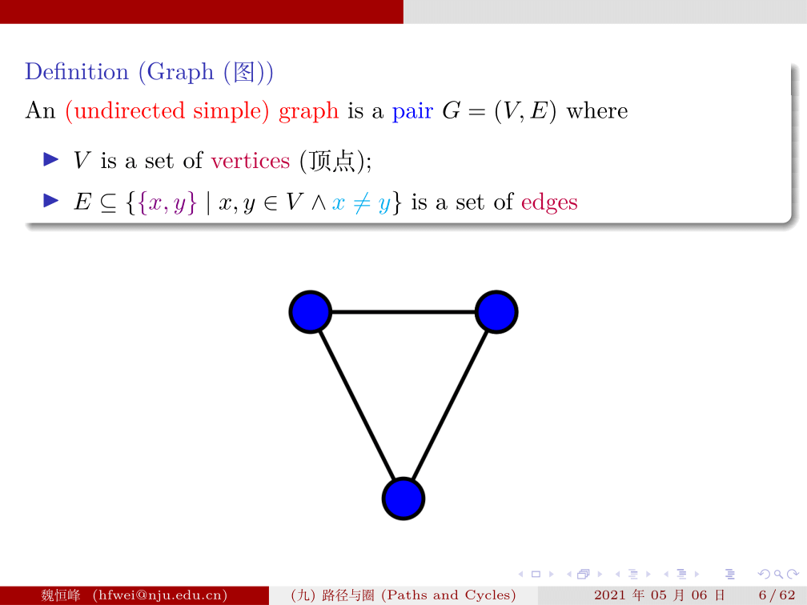
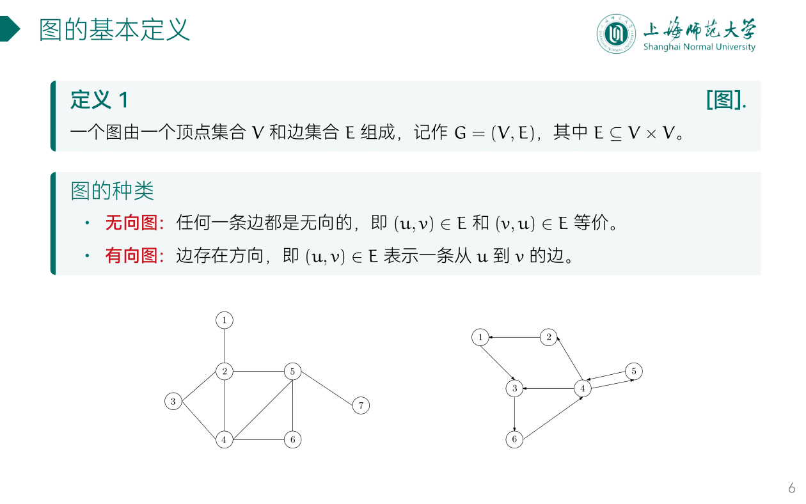
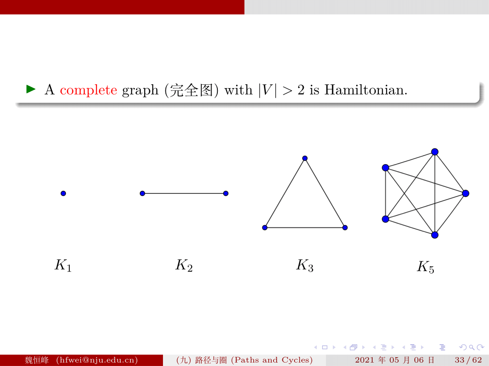
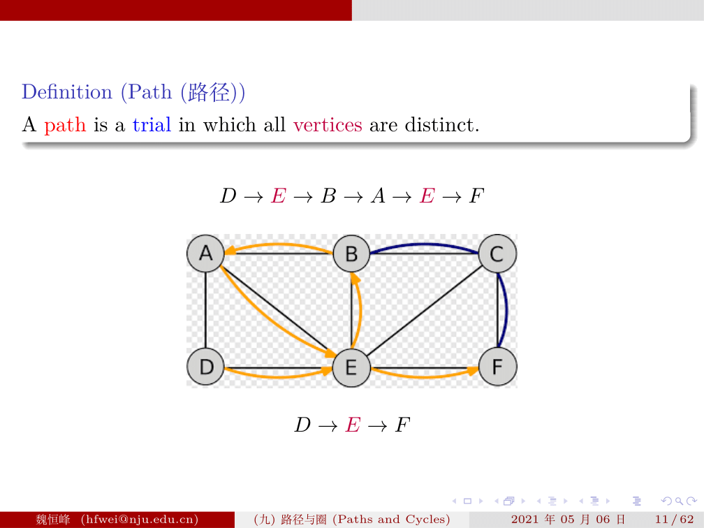

# Lec 11

## 作业回顾

### P1: Huffman Tree

假设某文本包含的字符为A,B,C,D,E,F,其对应的频率分别为20%,5%,2%,13%,35%,25%，请构造哈夫曼树，并给出每个字符的编码


### P2: Huffman Tree

假设用于通信的电文仅由8个字母组成，字母在电文中出现的频率分别为7、19、2、6、32、3、21、10，试为这8个字母设计哈夫曼编码，使用0～7的二进制表示形式是另一种编码方案。  

比较两个方案的优缺点。


哈夫曼编码是不等长编码，如果字符出现的频率不同，可以让频率高的字符采用尽可能短的编码，频率低的字符采用尽可能长的编码，从而可以获得更好的空间效率。

而如果每个字符的使用频率相等或相近，那么等长编码无疑是空间效率最高的编码方法。

在本题当中，由于字符的数量比较少，且不同字符的出现数量差距并不大，所以采用等长编码更节省空间，但如果这些字符的出现频次都乘以100，经过计算，哈夫曼编码的占用空间为 26100 bits，而等长编码的占用空间为 30000 bits，这时采用哈夫曼编码明显会有更好的空间效率。

### P3: Binary Tree

某二叉树的中序遍历序列为{D, G, B, A, E, C, F}，后序遍历序列为{G, D, B, E, F, C, A}，请建立此二叉树（画出二叉树图）并给出其对应的先序遍历序列。


Fri Nov  1 14:16:15 CST 2024

---

## 图

- <https://courses.cs.washington.edu/courses/cse373/24au/lessons/graphs/>
- <https://cs61b-2.gitbook.io/cs61b-textbook/22.-tree-traversals-and-graphs/22.3-graphs>
- <https://www.cs.cmu.edu/~rdriley/121/notes/graphs/>
- <https://cgi.luddy.indiana.edu/~yye/c343-2019/graph.php>
- <https://www.hello-algo.com/chapter_graph/graph>
- <https://github.com/courses-at-nju-by-hfwei/discrete-math-lectures/tree/main/9-paths-cycles>
- <https://algs4.cs.princeton.edu/40graphs/>

### 图的基本概念





- 顶点
- 边
- undirected graph, 无向图
	- $0 \le e \le n(n-1)$
- directed graph, 有向图
	- $0 \le e \le \frac{n(n-1)}{2}$


- 弧头顶点
- 弧尾顶点

#### 子图
#### 完全图



#### 度

- 入度
- 出度

- 度（degree）：一个顶点拥有的边数。
	- 对于有向图，入度（in-degree）表示有多少条边指向该顶点，出度（out-degree）表示有多少条边从该顶点指出。

$$
e=\frac{1}{2}\sum_{i}^nTD(v_i)
$$

#### 路径


#### 环
#### 有权图


#### 连通图


- 连通图：所有顶点皆可达
	- 连通分量：最大连通子图
	- 有向连通图
- 非连通图：存在顶点不可达

#### 邻接点

#### 最小生成树

- <https://oi-wiki.org/graph/mst/>

- 非连通图 < 生成树 < 环 

### 图的存储结构

- <https://cs61b-2.gitbook.io/cs61b-textbook/23.-graph-traversals-and-implementations/23.2-representing-graphs>

#### Adjacency Matrix, 邻接矩阵 (顺序存储)


- 每行表示出度的个数
- 每列表示入度的个数
- 弧的个数：有多少个 1


```
(A)                               (B)
  | 1  2  3  4  5                  | 1  2  3  4  5
--|--------------                --|--------------
1 |    1        1                1 |    1        1 
2 |       1                      2 | 1     1     1
3 |          1                   3 |    1     1
4 |             1                4 |       1     1
5 |    1                         5 | 1  1     1
```

#### Adjacency List, 邻接表


### 图的遍历

### 拓扑排序

### 关键路径

---