# Tree, 树

- <https://www.cs.cmu.edu/~ckingsf/bioinfo-lectures/trees.pdf>

- https://www.cs.cmu.edu/~rdriley/121/notes/bst/

- https://courses.cs.vt.edu/cs3114/Fall20/notes/T02_BinaryTreeTheorems.pdf
- https://courses.cs.vt.edu/~cs3114/Summer11/Notes/T03a.BinaryTreeTheorems.pdf
- https://pages.cs.wisc.edu/~siff/CS367/Notes/bsts.html

## Hierarchies

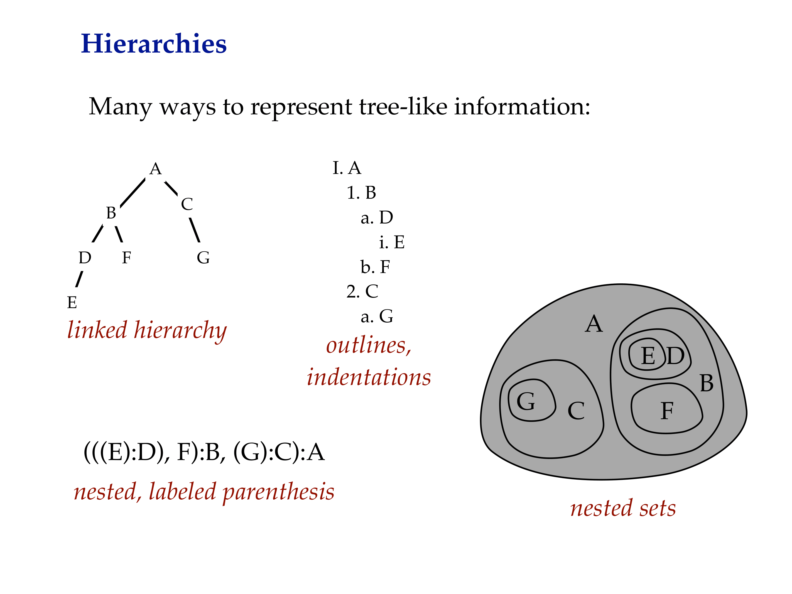

## Definition

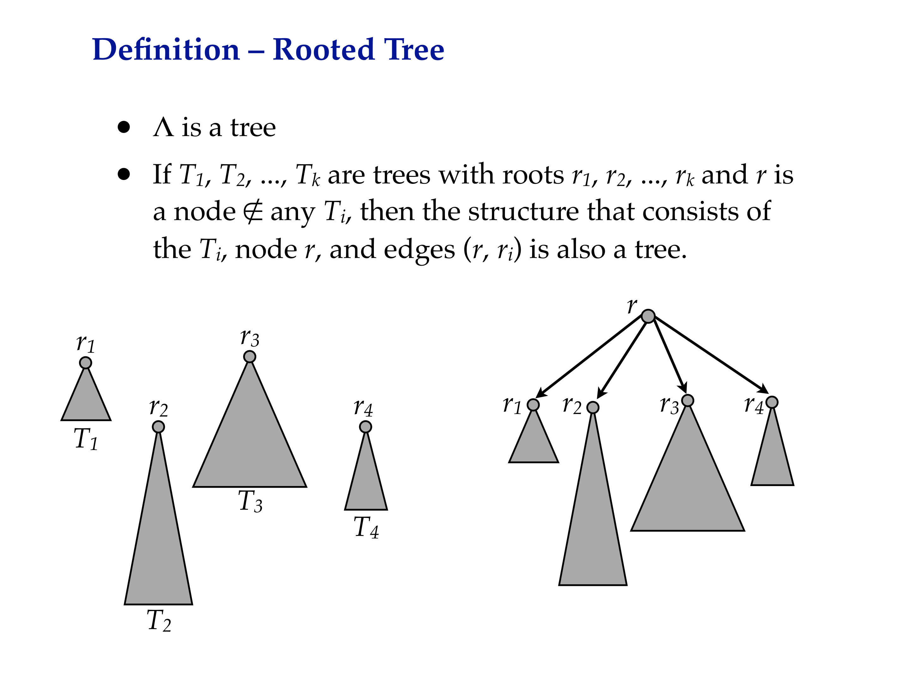

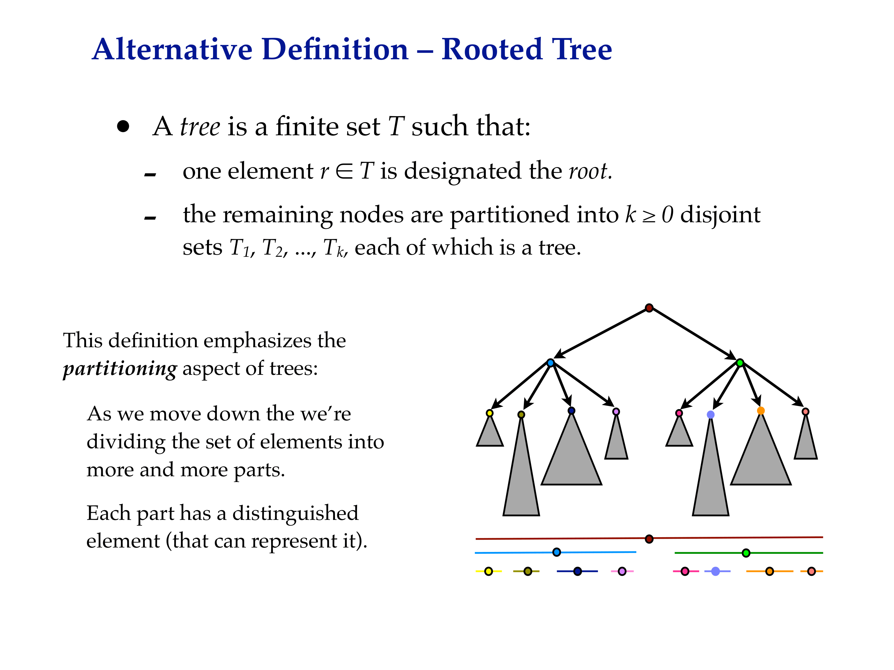
## Terminology

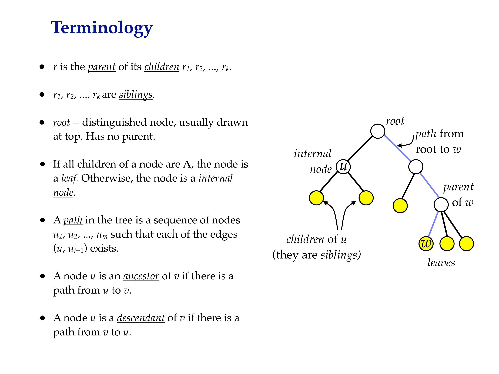
## Height & Depth

- The **height** of node u is the length of the longest path from u to a leaf.
- The **depth** of node u is the length of the path from the root to u.
- Height of the tree = maximum depth of its nodes.
- A **level** is the set of all nodes at the same depth.

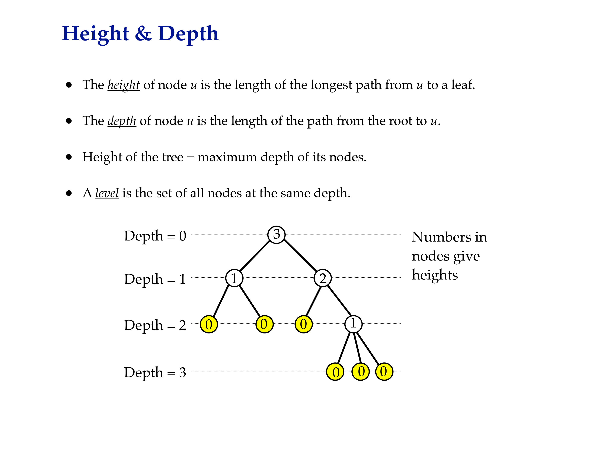


## Subtrees, forests, and graphs

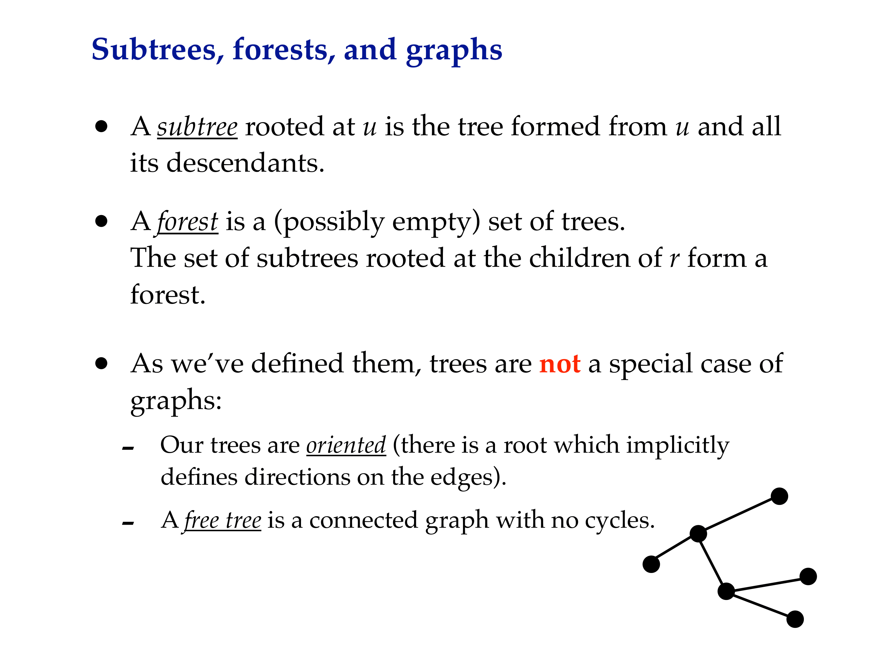


## Binary Tree, 二叉树

### Definition: Binary Trees

> **二叉树**
> 
> 二叉树是顶点的一个有限集合，该集合或者为空，或者由一个根节点和两棵不相交的分别称为根节点的左子树和右子树的二叉树组成。

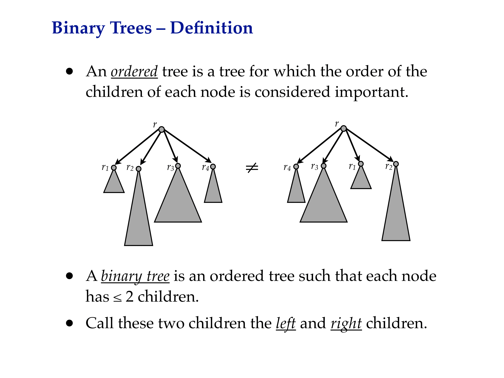

- An **ordered** tree is a tree for which the order of the children of each node is considered important.
- A **binary tree** is an ordered tree such that each node has <= 2 children.
- Call these two children the **left** and **right** children.

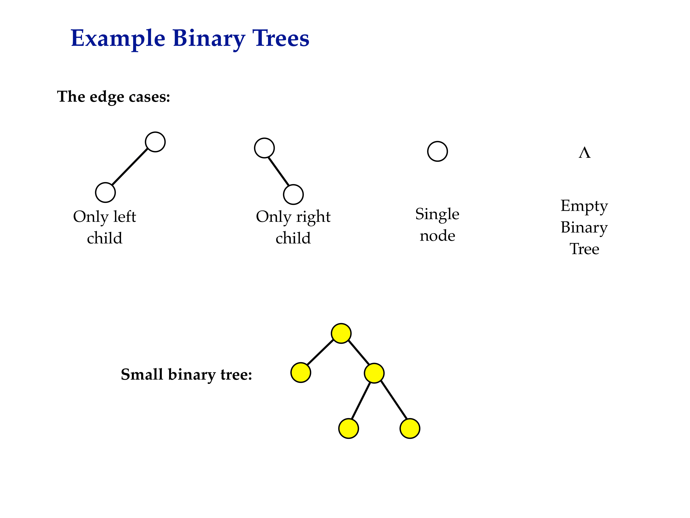

- The edge cases
	- only left child
	- only right child
	- single node
	- empty binary tree
	- small binary tree

### Definition: Extended Binary Trees

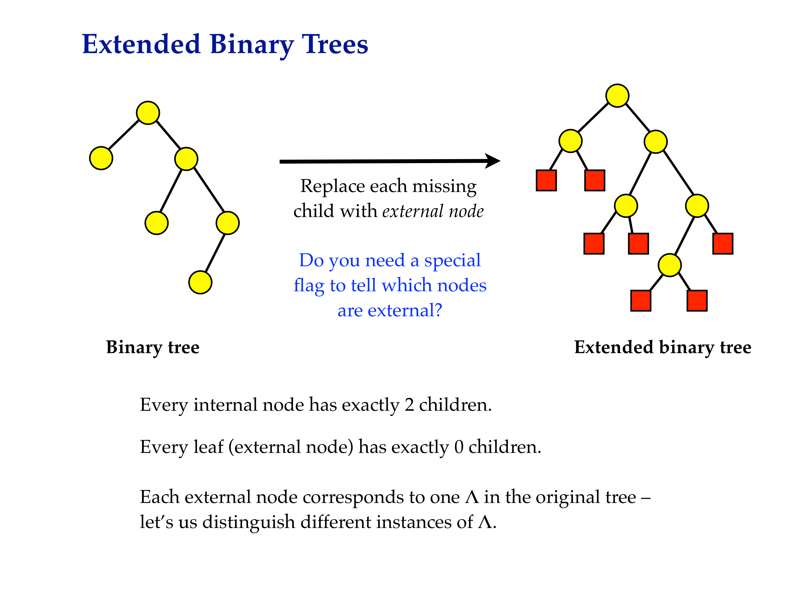

- Every internal node has exactly 2 children.
- Every leaf (external node) has exactly 0 children.
- Each external node corresponds to one A in the original tree - let's distinguish different instances of A.

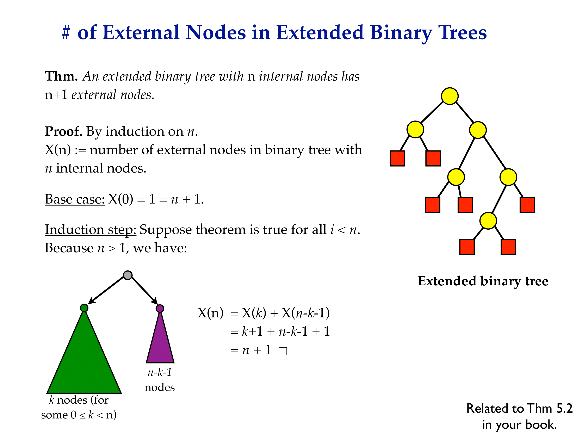

**Thm.** An extended binary tree with $n$ internal nodes has $n+1$ external nodes.

**Proof.** By induction on n.
$X(n)$: = number of external nodes in binary tree with $n$ internal nodes.

**Base case**: $X(0)=1=n+1$.

Induction step: Suppose theorem is true for all $i<n$.
Because $n\ge 1$, we have:

$$
X(n)=X(k)+X(n-k-1) \\
= k+1+n-k-1+1 \\
= n+1\square
$$


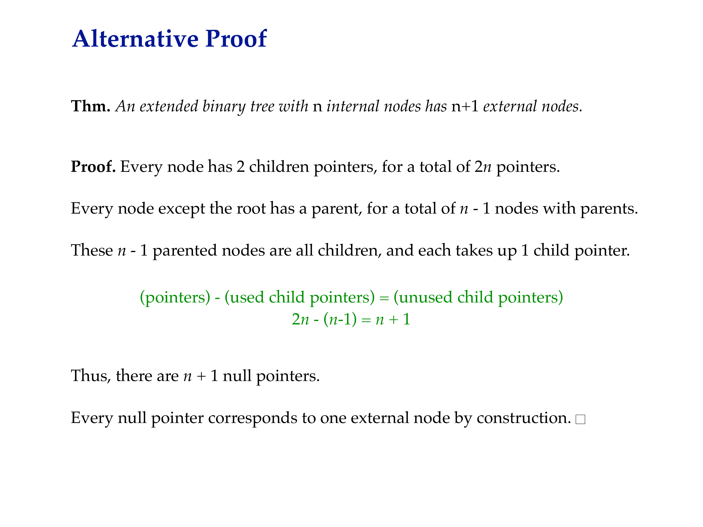

### 二叉树的种类

- **满二叉树**：除了叶节点外，每个节点都有两个子节点的二叉树称为满二叉树。
- **完全二叉树**：所有叶子在同一层的满二叉树称为完全二叉树。
- **几乎完全的二叉树**：除了最后一层外，每一层都是满的，且最后一层上的叶子都尽可能地靠左的二叉树称为几乎完全的二叉树。


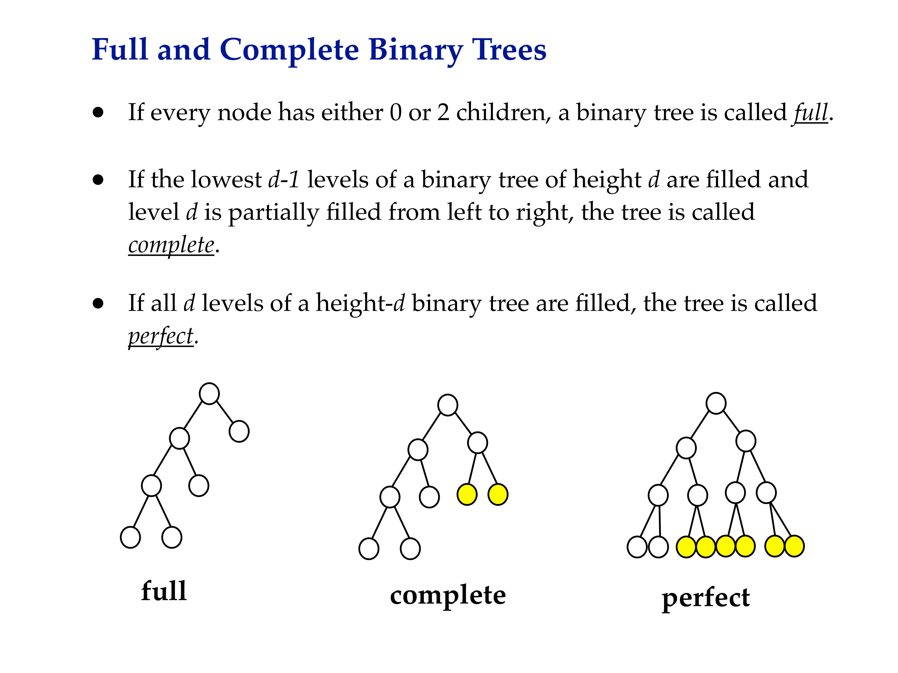

- If every node has either 0 or 2 children, a binary tree is called **full**.
- If the lowest $d-1$ levels of a binary tree of height $d$ are filled and level $d$ is partially filled from left to right, the tree is called **complete**.
- If all $d$ levels of a height-$d$ binary tree are filled, the tree is called **perfect**.

### 关于树的命名

上述的命名可能和一般的数据结构会有所区别，我们这里作进一步的解释。

我们从英文的命名来说明，考虑一颗 m-ary 树，其指的是“each node has no more than m children”，即没有一个节点有超过 m 个子节点。

而事实上，我们一般关注的有如下几种特殊的树：

- Full m-ary tree.
- Complete m-ary tree.
- Perfect m-ary tree.

> **Full m-ary tree**
> 
> A full m-ary tree is an m-ary tree where within each level every node has **0** or **m** children.

也就是说，每个节点要么是叶子节点，要么有 m 个子节点。


> **Complete m-ary tree**
> 
> A complete m-nary tree is a m-nary tree in which every level, except possibly the last, is completely filled, and all nodes in the last level are as far left as possible.

也就是说，**除了最后一层外，每一层都是满的，且最后一层上的叶子都尽可能地靠左的**。


> **Perfect m-ary tree**
> 
> A perfect m-nary tree is a m-nary tree in which all interior nodes have two children and all leaves have the same depth or same level.

也就是说，**树所有的叶子节点都在同样的深度上，并且所有的非叶子节点都有 m 个子节点**。


可以看到：
1. 一颗 perfect m-nary tree 一定是 full m-nary tree，也是 complete m-nary tree。
2. full m-nary tree 和 complete m-nary tree 之间没有必然的联系。

> **英文的定义也有歧义！**
> 
> 事实上，关于 complete m-nary tree 和 perfect m-nary tree，英文的定义也有区别，有 的定义中：
> 1. 将complete m-nary tree定义为perfect m-nary tree。
> 2. 上述定义中的complete m-nary tree称为nearly complete m-nary tree或者almost complete m-nary tree。

到这可以看到，关于中文，我们实际上是翻译的区别：

| 英文                  | 本课教材 & 课件  | 数据结构课程 & 其他书籍 |
| ------------------- | ---------- | ------------- |
| Full m-ary tree     | 满 m 叉树     | 正则 m 叉树       |
| Complete m-ary tree | 几乎完全的 m 叉树 | 完全 m 叉树       |
| Perfect m-ary tree  | 完全 m 叉树    | 满 m 叉树        |

我个人还是更倾向于使用本课教材的命名方式。

大家也要注意，命名其实不关键，注意使用的 scope 即可。在相应的领域，重名其实是 很常见的，还是要看定义的描述。

### Binary Tree Theorems, 二叉树的性质

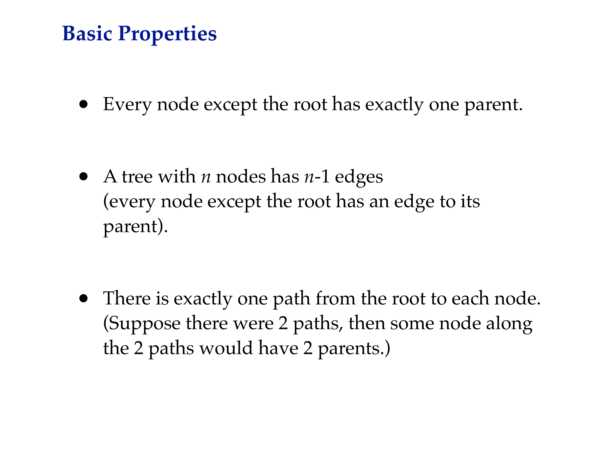

#### Nodes in a Perfect Tree of Height h

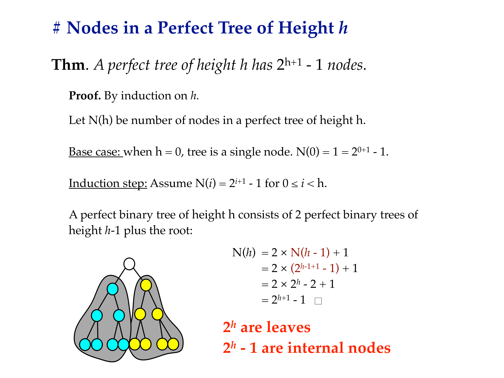

> **Thm.** A *perfect tree* of height $h$ has $2^{h+1}-1$ nodes.

**Proof.** By **induction** on $h$.

Let $N(h)$ be number of nodes in a *perfect tree* of height $h$.

**Base case**: when $h = 0$, tree is a single node. $N(0)=1=2^{0+1}-1$.

**Induction step**: Assume $N(i)=2^{i+1}-1$ for $0\le i\lt h$.

A perfect binary tree of height $h$ consists of 2 perfect binary trees of height $h-1$ plus the root.

- $2^h$ are leaves
- $2^h-1$ are internal nodes

#### Full Binary Tree Theorem

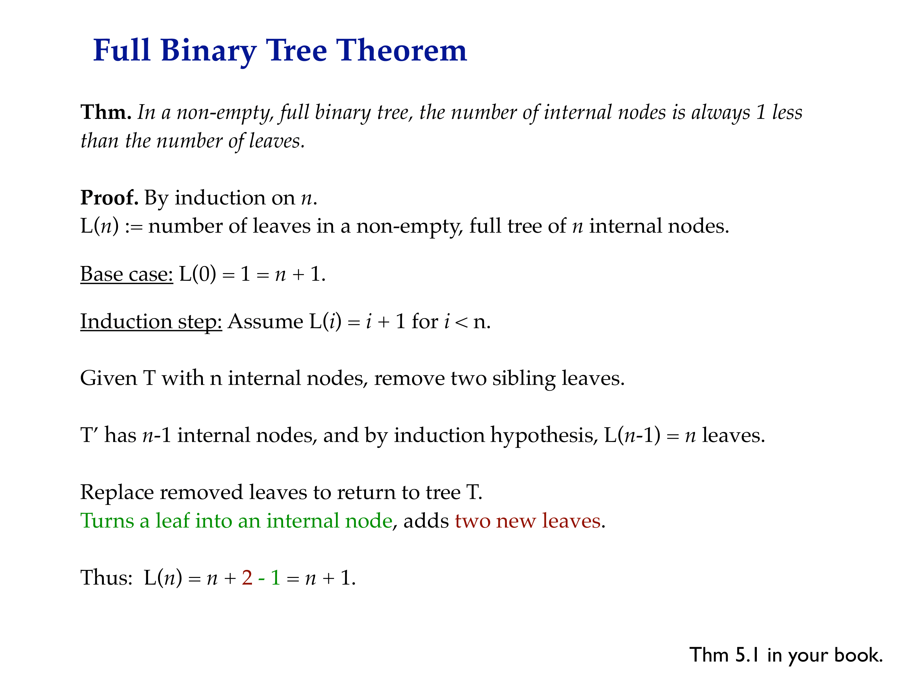

**Thm.** In a non-empty, full binary tree, the number of internal nodes is always 1 less than the number of leaves.

**Proof.** By induction on $n$.

$L(n)$: = number of leaves in a non-empty, full tree of $n$ internal nodes.

Base case: $L(0)=1=n+1$.

Induction strp: Assume $L(i)=i+1$ for $i<n$.

Given $T$ with $n$ internal nodes, remove two sibling leaves.

$T'$ has $n-1$ internal nodes, and by induction hypothesis, $L(n-1)=n$ leaves.

Replace removed leaves to return to tree $T$.

Turns a leaf into an internal node, adds two new leaves.

Thus: $L(n)=n+1-1=n+1$.


---

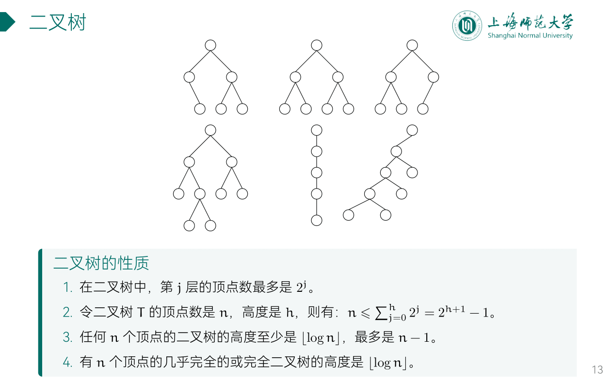

1. 在二叉树中，第 $j$ 层的顶点数最多是 $2^j$
2. 令二叉树 $T$ 的顶点数是 $n$，高度是 $h$，则有：$n<=\sum_{j=0}^{h}2^j=2^{h+1}-1$
3. 任何 n 个顶点的二叉树的高度至少是 $\lfloor log_{n}\rfloor$，最多是 $n-1$
4. 有 n 个顶点的几乎完全的或完全二叉树的高度是 $\lfloor\log_{n}\rfloor$

---

> Let $T$ be a binary tree. For every $k\ge 0$, there are no more than $2^k$ nodes in level $k$.

> Let $T$ be a binary tree with $\lambda$ levels. Then T has no more than $2^{\lambda}-1$ nodes.

> Let $T$ be a binary tree with $N$ nodes. Then the number of levels is at least $\lceil\log(N+1)\rceil$.

> Let $T$ be a binary tree with $L$ leaves. Then the number of levels is at least $\lceil\log{L}\rceil+1$. 

### 二叉树的数组表示

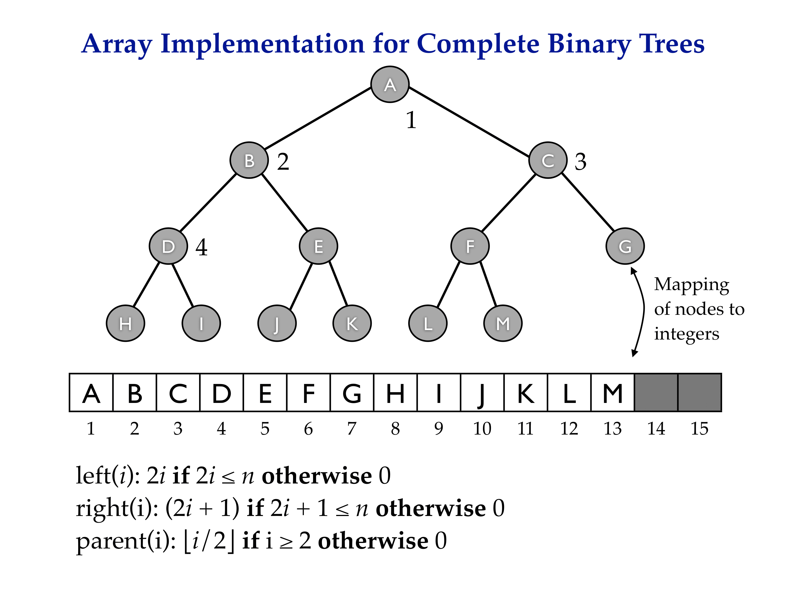

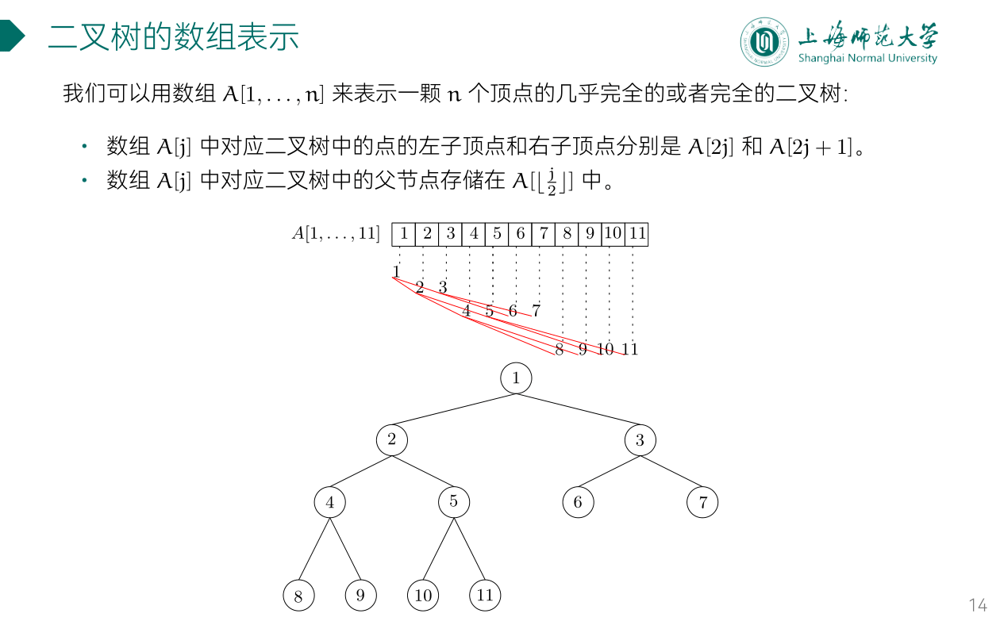

## Binary Tree ADT

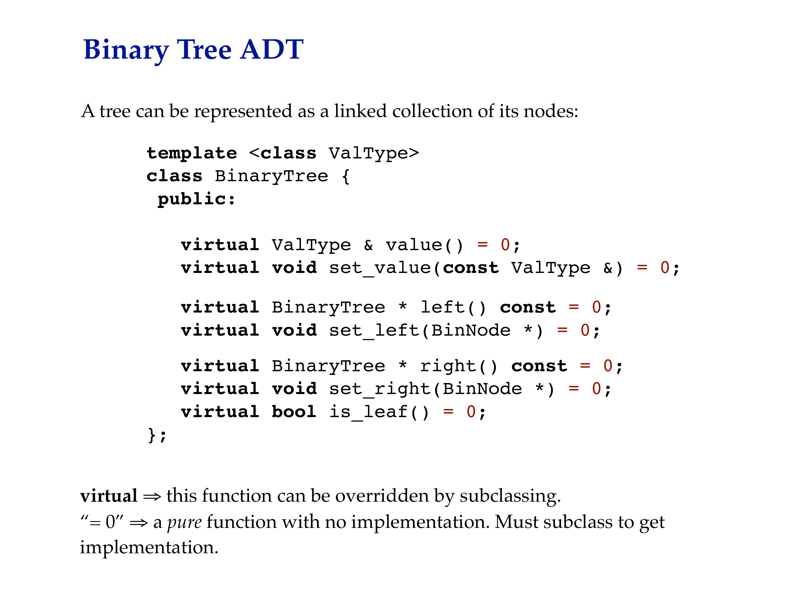

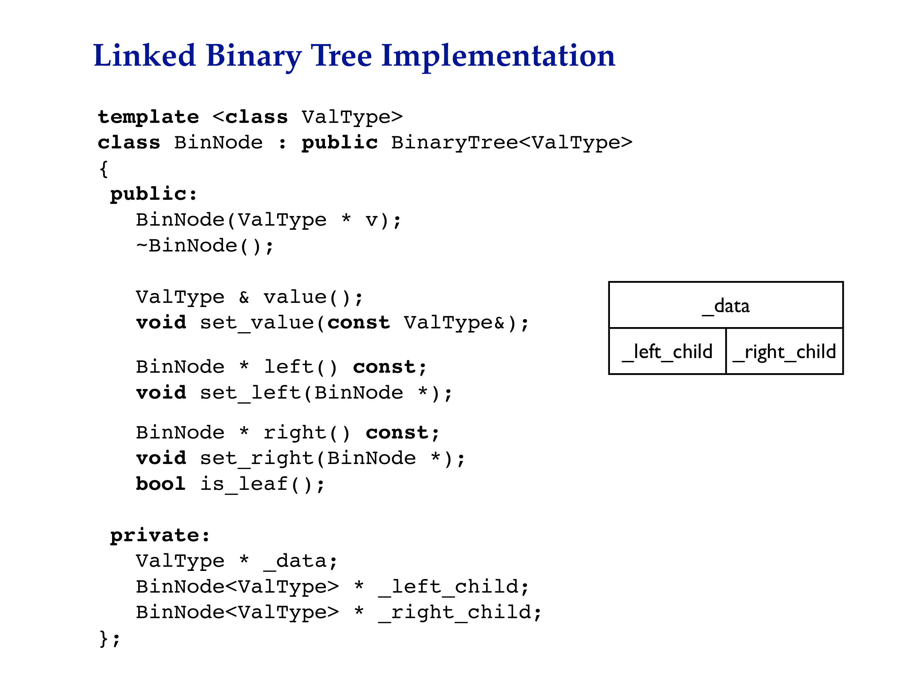

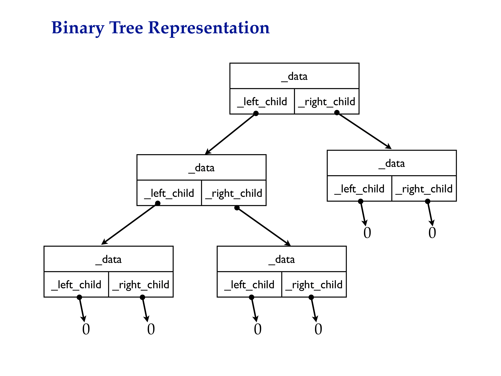

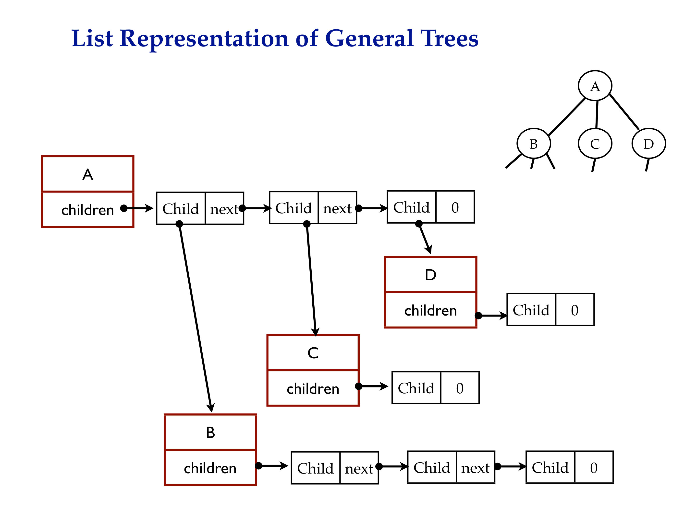

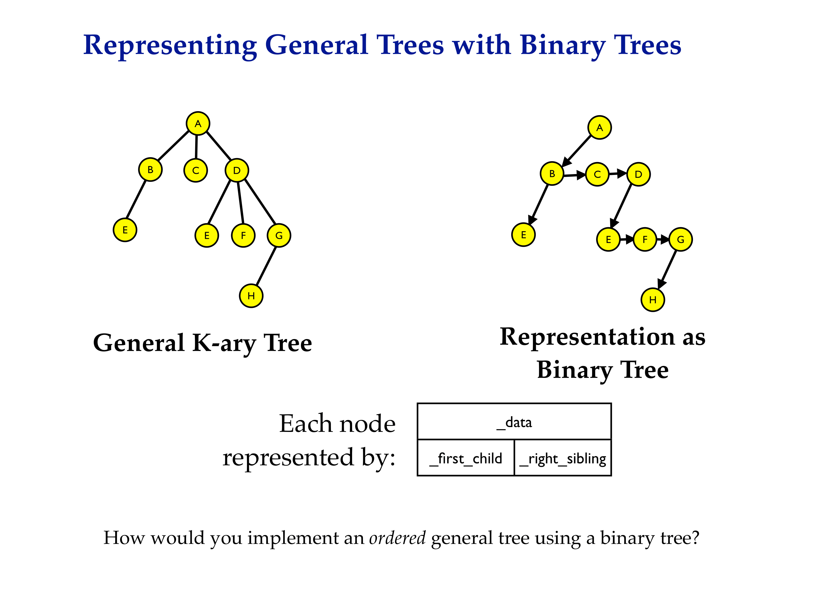

```c
TreeNode* createNode(int value) {
	TreeNode* node = (TreeNode*)malloc(sizeof(TreeNode));
	if (node == NULL) { printf("Error\n");
		exit(EXIT_FAILURE);
	}
	node->value = value;
	node->left = NULL;
	node->right = NULL;
	return node;
}
```

```c
TreeNode* createBinaryTree() {
	// 创建根节点
	TreeNode* root = createNode(1);
	
	// 创建左子树
	root->left = createNode(2);
	root->left->left = createNode(4);
	root->left->right = createNode(5);
	
	// 创建右子树
	root->right = createNode(3);
	root->right->left = createNode(6);
	root->right->right = createNode(7);
	
	return root;
}
```

```c
```

### 二叉树常见术语

- 根节点（root node）：位于二叉树顶层的节点，没有父节点。
- 叶节点（leaf node）：没有子节点的节点，其两个指针均指向 `None` 。
- 边（edge）：连接两个节点的线段，即节点引用（指针）。
- 节点所在的层（level）：从顶至底递增，根节点所在层为 1 。
- 节点的度（degree）：节点的子节点的数量。在二叉树中，度的取值范围是 0、1、2 。
- 二叉树的高度（height）：从根节点到最远叶节点所经过的边的数量。
- 节点的深度（depth）：从根节点到该节点所经过的边的数量。
- 节点的高度（height）：从距离该节点最远的叶节点到该节点所经过的边的数量。

---

- 度
- 叶子
- 孩子
- 双亲
- 子孙
- 祖先
- 层
- 兄弟
- 堂兄弟
- ⼆叉树的度
- ⼆叉树的深度


- **满⼆叉树**：在⼀棵⼆叉树中，如果所有分支结点都存在左⼦树和右⼦树， 并且所有叶⼦结点都在同⼀层上，这样的⼆叉树称为满⼆叉树。
- https://www.hello-algo.com/chapter_tree/binary_tree/#1_1

## Readings

- <https://www.hello-algo.com/chapter_tree/binary_tree/>